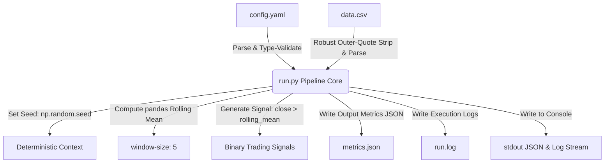

# MLOps Batch Signal Pipeline — T0 Technical Assessment


A production-grade, highly observable, reproducible, and containerized MLOps batch job pipeline built in Python. This project computes a rolling-mean-based binary trading signal on OHLCV market data, designed to mirror the trading signal pipelines used in **MetaStackerBandit**.

---

## Table of Contents
1. [Project Overview & Goals](#project-overview--goals)
2. [System Architecture & Data Flow](#system-architecture--data-flow)
3. [Repository Layout](#repository-layout)
4. [File Descriptions](#file-descriptions)
5. [Prerequisites & Dependencies](#prerequisites--dependencies)
6. [Local Environment Setup](#local-environment-setup)
7. [Command-Line Interface (CLI) Reference](#command-line-interface-cli-reference)
8. [Algorithmic Processing Logic](#algorithmic-processing-logic)
    - [Step 1: Configuration Loading & Verification](#step-1-configuration-loading--verification)
    - [Step 2: Dataset Loading & Robust CSV Parsing](#step-2-dataset-loading--robust-csv-parsing)
    - [Step 3: Rolling Mean Calculation](#step-3-rolling-mean-calculation)
    - [Step 4: Binary Trading Signal Generation](#step-4-binary-trading-signal-generation)
    - [Step 5: Metrics Extraction & Timing](#step-5-metrics-extraction--timing)
9. [Robust Input Validation & Error Handling](#robust-input-validation--error-handling)
10. [Observability & Structured Logging](#observability--structured-logging)
11. [Output Specifications (JSON)](#output-specifications-json)
    - [Success Metrics Schema](#success-metrics-schema)
    - [Error Metrics Schema](#error-metrics-schema)
12. [Reproducibility & Determinism](#reproducibility--determinism)
13. [Dockerization & Deployment Readiness](#dockerization--deployment-readiness)
    - [Building the Image](#building-the-image)
    - [Running the Container](#running-the-container)
    - [Extracting Output Files from the Container](#extracting-output-files-from-the-container)
14. [Local Verification & Troubleshooting Checklist](#local-verification--troubleshooting-checklist)

---

## Project Overview & Goals

The goal of this project is to build an MLOps-style batch pipeline that prioritizes:
- **Reproducibility**: Deterministic signal calculations using configuration versioning and fixed random seeds.
- **Observability**: Rich, structured, and machine-readable metrics paired with human-readable logs capturing performance stats and errors.
- **Robustness**: Fault-tolerant file loaders capable of intercepting corrupt configs, missing files, malformed formats, and column issues without program crashes.
- **Deployment Readiness**: A clean, single-command run inside a lightweight Docker container containing zero hard-coded paths.

---

## System Architecture & Data Flow

Below is the conceptual architecture of the batch execution pipeline:



---

## Repository Layout

```
.
├── run.py              # Entry point for pipeline logic
├── config.yaml         # Config params (seed, window, version)
├── data.csv            # 10,000-row OHLCV dataset (provided)
├── requirements.txt    # Pins exact python dependencies
├── Dockerfile          # Builds python:3.9-slim runtime image
├── .dockerignore       # Limits files sent to Docker build context
├── .gitignore          # Prevents tracking cache/venv files
├── metrics.json        # Output success metrics from the latest run
├── run.log             # Output execution log from the latest run
└── README.md           # Project documentation (this file)
```

---

## File Descriptions

*   **`run.py`**: The entry point. Handles arguments parsing, config/dataset validations, rolling math operations, structured output generation, and logging.
*   **`config.yaml`**: The run configurations. Specifies the deterministic execution seed, the lookback rolling window parameter, and the run version identifier.
*   **`data.csv`**: A historical 10,000-row cryptocurrency OHLCV dataset. Features a unique formatting where entire rows are enclosed in outer double quotes.
*   **`requirements.txt`**: Standard Python dependency file. Specifies pinned, compatible libraries: `pandas`, `numpy`, and `PyYAML`.
*   **`Dockerfile`**: Self-contained, automated build file using `python:3.9-slim`. Installs components and runs the batch job using clean CLI parameters.
*   **`.dockerignore`**: Optimizes the build context and image sizes by ignoring local Python caches (`__pycache__`), local environments (`.venv`), and markdown files.
*   **`.gitignore`**: Configures Git to avoid tracking IDE directories (`.vscode`, `.idea`), local environments (`.venv`), and compile caches (`__pycache__`), while explicitly allowing output metrics and logs.

---

## Prerequisites & Dependencies

To execute this pipeline, you need:
- **Python 3.9 or higher** (Tested up to Python 3.11)
- **Docker** (For containerization test cases)

Pinned packages in `requirements.txt`:
- `pandas==2.2.2` (for tabular load and rolling data manipulations)
- `numpy==1.26.4` (for vectorized math assertions and seeding)
- `PyYAML==6.0.1` (for parsing the configuration file)

---

## Local Environment Setup & Execution Walkthrough

Follow these exact steps to clone, set up, and run the pipeline locally.

### 1. Clone and Navigate to the Repository
Copy and run these commands to fetch the repository and change directory:
```bash
git clone https://github.com/shaawtymaker/ML_Ops-Batch-job.git mlops-batch-job-development
cd mlops-batch-job-development
```

### 2. Set Up a Virtual Environment
Create a clean virtual environment to isolate the project's dependencies:
```bash
python3 -m venv .venv
```

### 3. Activate the Virtual Environment
Activate the environment depending on your operating system and terminal shell:

*   **Linux / macOS (Bash/Zsh)**:
    ```bash
    source .venv/bin/activate
    ```
*   **Windows (PowerShell)**:
    ```powershell
    .venv\Scripts\Activate.ps1
    ```
*   **Windows (CMD)**:
    ```cmd
    .venv\Scripts\activate.bat
    ```

### 4. Install Pinned Dependencies
Upgrade package manager tools and install dependencies:
```bash
python -m pip install --upgrade pip
pip install -r requirements.txt
```

---

## Command-Line Interface (CLI) Reference

The application runs using exactly four parameterized CLI arguments. There are **no hard-coded paths** within the script.

```bash
python run.py \
  --input <input_csv_path> \
  --config <config_yaml_path> \
  --output <output_metrics_json_path> \
  --log-file <output_run_log_path>
```

### Argument Details:

| Argument | Description | Required | Validation Constraints |
|---|---|---|---|
| `--input` | Path to input OHLCV CSV file | Yes | Must exist, be non-empty, and contain a valid `close` column. |
| `--config` | Path to config YAML file | Yes | Must exist, be valid YAML, and contain typed `seed`, `window`, and `version` fields. |
| `--output` | Destination path for output JSON metrics | Yes | Directory will be created automatically if it does not exist. |
| `--log-file` | Destination path for detailed pipeline log | Yes | Directory will be created automatically if it does not exist. |

---

## Algorithmic Processing Logic

The execution inside `run.py` proceeds sequentially as follows:

### Step 1: Configuration Loading & Verification
The YAML configuration file is parsed via `yaml.safe_load()`. The pipeline validates:
- The config contains a dictionary mapping at the root level.
- All required keys (`seed`, `window`, `version`) are present.
- Field types match expectations (`seed` must be an integer, `window` must be an integer, `version` must be a string).
- The `window` size is a positive integer (`window >= 1`).

### Step 2: Dataset Loading & Robust CSV Parsing
The `data.csv` dataset is loaded with robust handling to resolve quoting issues.
*   **The Quoted-CSV Edge Case**: 
    The raw `data.csv` is formatted with outer double-quotes enclosing each entire comma-separated line:
    ```
    "timestamp,open,high,low,close,volume_btc,volume_usd"
    "2024-01-01 00:00:00,44910.83,45085.78,44910.83,45024.68,3.640837,163927.55"
    ```
    To handle this, `run.py` reads the file lines, detects if the header line is wrapped in outer quotes, and strips the wrapping double quotes programmatically before parsing with Pandas. This allows the program to read **both** normal CSVs and quoted-row CSV formats.

### Step 3: Rolling Mean Calculation
The rolling mean is calculated on the `close` column using the `window` size loaded from the configuration file.
*   **Warm-up Rows Policy**: 
    The first `window - 1` rows do not have sufficient history to calculate a rolling mean, resulting in `NaN` (not a number) values. The pipeline keeps these rows in the dataset (ensuring `rows_processed` equals the input row count) but defaults their calculated signal value to `0`.

### Step 4: Binary Trading Signal Generation
For each row, the close price is compared to the computed rolling mean:
- **`signal = 1`** if `close > rolling_mean`
- **`signal = 0`** if `close <= rolling_mean` (or if the rolling mean is `NaN` due to warm-up rows).

### Step 5: Metrics Extraction & Timing
A high-resolution timer (`time.perf_counter()`) tracks the execution latency. The pipeline aggregates the final execution metrics:
- **`rows_processed`**: Total number of lines successfully parsed (exactly `10000` for the input file).
- **`signal_rate`**: The arithmetic mean of the binary signal column, rounded to 4 decimal places (`0.4989` on success).
- **`latency_ms`**: Total job execution duration in milliseconds.

---

## Robust Input Validation & Error Handling

To ensure production-grade security, the application intercepts errors before they propagate:
1.  **Missing Input/Config File**: Explicitly verified via `os.path.isfile()`. Throws a clean descriptive exception if missing.
2.  **Empty Files**: Verified via `os.path.getsize()`. Catches empty inputs before parsing.
3.  **Invalid YAML Syntax**: Captured via `yaml.YAMLError` to prevent library crashes.
4.  **Missing CSV Column**: Ensures that the `close` column is present in the CSV headers, failing gracefully if missing.
5.  **Invalid Data Values**: Coerces `close` prices to numeric formats via `pd.to_numeric()`. If any invalid values (e.g. text strings, NaNs) are found, a `PipelineError` is raised.

When any validation check fails, the pipeline immediately halts, logs the stack trace to the log file, writes a structured error JSON to the output path, prints it to `stdout`, and exits with code `1`.

---

## Observability & Structured Logging

Execution logs are generated using Python’s standard `logging` library. The log configuration uses an ISO-8601 compliant formatting that prints `INFO` levels to the console (`stdout`) and writes `DEBUG` levels to the log file.

### Log Format
```
YYYY-MM-DDTHH:MM:SS+TZ | LEVEL    | Log Message
```

### Key Lifecycle Events Logged:
- Job start timestamp along with input CLI arguments.
- Config loaded details showing parsed parameters (`seed`, `window`, `version`).
- Random seed initialization messages.
- Dataset loaded details showing total rows and column schemas.
- Rolling calculation completion messages.
- Signal generation stats (including number of defaulted warm-up rows and computed signal rate).
- Detailed metrics summaries.
- Job completion status (`success` or `error`).
- System exception traces (if any occur).

---

## Output Specifications (JSON)

### Success Metrics Schema
An exact schema is written to the metrics file and printed to stdout upon a successful run:

```json
{
  "version": "v1",
  "rows_processed": 10000,
  "metric": "signal_rate",
  "value": 0.4989,
  "latency_ms": 58,
  "seed": 42,
  "status": "success"
}
```

### Error Metrics Schema
If an validation check fails, an error JSON is written to the output file and printed to stdout:

```json
{
  "version": "v1",
  "status": "error",
  "error_message": "Input data file not found: nonexistent.csv"
}
```

---

## Reproducibility & Determinism

Determinism is guaranteed across environments:
1.  **Fixed Seeding**: The numpy random state is seeded immediately after loading the configuration using `np.random.seed(seed)`.
2.  **No Unseeded Code Paths**: Signal logic relies purely on deterministic comparisons against the close prices.
3.  **Consistent Signal Rates**: The output `signal_rate` matches exactly across executions. For the standard dataset and config, the output value is always `0.4989`.

---

## Dockerization & Deployment Readiness

The pipeline includes a `Dockerfile` built on `python:3.9-slim` to ensure a self-contained runtime environment.

### 1. Build the Docker Image
Run this build command from the repository root:
```bash
docker build -t mlops-task .
```

### 2. Run the Container (Success Path)
Run the default pipeline built into the container:
```bash
docker run --rm mlops-task
```
*   **Action**: Copies root files, executes the pipeline, prints the success metrics JSON to `stdout`, and exits with code `0`.

#### To Check the Exit Status:
*   **Linux / macOS**: `echo $?`
*   **Windows (PowerShell)**: `echo $LASTEXITCODE`
*   **Windows (CMD)**: `echo %errorlevel%`

### 3. Run the Container (Failure Path)
Run the pipeline pointing to a non-existent file inside the container:
```bash
docker run --rm mlops-task python run.py --input nonexistent.csv --config config.yaml --output metrics.json --log-file run.log
```
*   **Action**: Prints the structured error metrics JSON to `stdout`, and exits with a non-zero code (`1`).

#### To Check the Exit Status:
*   **Linux / macOS**: `echo $?`
*   **Windows (PowerShell)**: `echo $LASTEXITCODE`
*   **Windows (CMD)**: `echo %errorlevel%`

### 4. Extracting Output Files from the Container
If you need to extract the files generated inside the container runtime to your host:
```bash
docker run --name mlops-task-run mlops-task
docker cp mlops-task-run:/app/metrics.json ./metrics.json
docker cp mlops-task-run:/app/run.log ./run.log
docker rm mlops-task-run
```

---

## Local Verification & Troubleshooting Checklist

Before committing code, verify the local execution setup using these commands:

### 1. Local Run (Success Path)
Execute the batch job using the standard dataset and configuration:
```bash
python run.py --input data.csv --config config.yaml --output metrics.json --log-file run.log
```
#### Checks:
- [ ] Confirms the success JSON is printed to the terminal.
- [ ] Confirms `metrics.json` and `run.log` files are created at the root level.
- [ ] Confirms the exit status code is `0`:
  *   **Linux / macOS**: `echo $?` (should print `0`)
  *   **Windows (PowerShell)**: `echo $LASTEXITCODE` (should print `0`)
  *   **Windows (CMD)**: `echo %errorlevel%` (should print `0`)

### 2. Local Run (Failure Path)
Execute the batch job using a missing CSV path to test error handling:
```bash
python run.py --input nonexistent.csv --config config.yaml --output metrics.json --log-file run.log
```
#### Checks:
- [ ] Confirms that it prints an error JSON with `"status": "error"` and the error message.
- [ ] Confirms `metrics.json` is overwritten with the error JSON content.
- [ ] Confirms the exit status code is `1` (non-zero):
  *   **Linux / macOS**: `echo $?` (should print `1`)
  *   **Windows (PowerShell)**: `echo $LASTEXITCODE` (should print `1`)
  *   **Windows (CMD)**: `echo %errorlevel%` (should print `1`)

